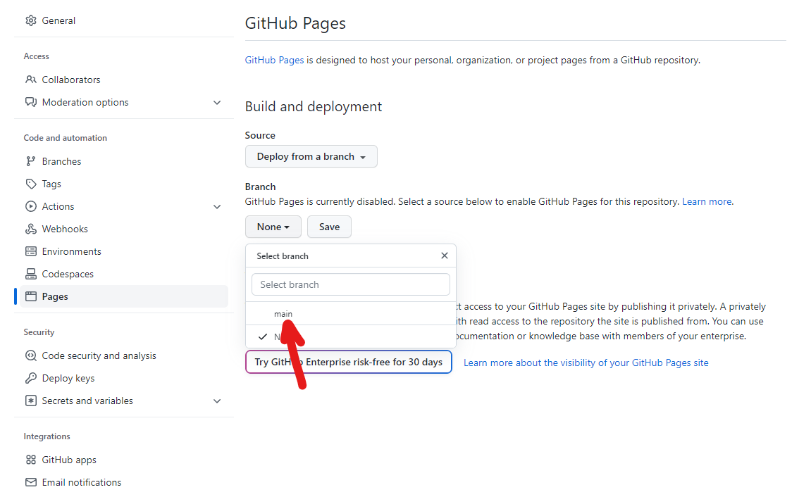
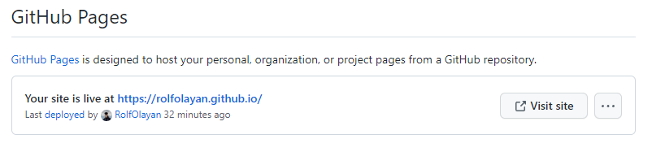
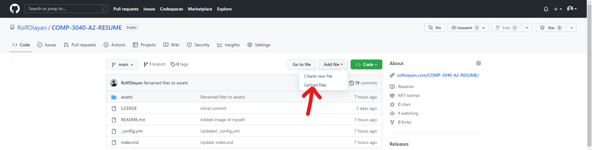
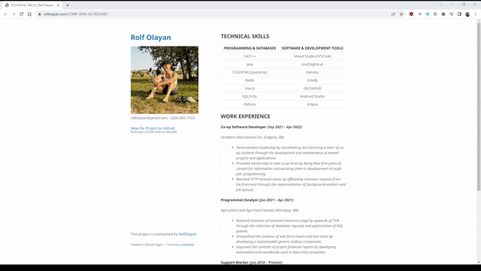

# How To Host Your Own Resume On GitHub Pages

# Purpose
The purpose of this README is to provide instructions to fellow computer science students on how to host a Markdown formatted resume on GitHub Pages. Additionally, it aims to introduce and demonstrate the principles of Andrew Etter's book Modern Technical Writing to the reader. At the end of this tutorial, the reader should have have the means and knowledge to display their own resumes.

# Prerequisites
Before you begin, please make sure that you have the following prerequisites:
- **Markdown Formatted Resume**
- **GitHub account**

# Instructions
For the purpose of this tutorial, I will be conducting majority of my code changes through GitHub itself. In doing so, I hope to demonstrate the ease of working with Markdown and GitHub Pages. Also, it should show that you do not need to download any code editors or require the knowledge to build a Jekyll static site locally on your machine.

## Creating a GitHub Pages Enabled Repository
1) Let's begin by navigating to [GitHub](https://github.com/) and logging in.
2) [Create a new repository](https://github.com/new).
    - Hosting our site on GitHub has the added benefit distributed version control system which allows the documenting of the changes that we commit over time.
3) Name the repository _username.github.io_ (with _username_ being your GitHub username).
4) Open your repository
5) Open the _Settings_ menu
6) Open the _Pages_ section under _Code and automation_
7) Select the _main_ branch and save



8) Wait up to several minutes GitHub to build your site
9) Refresh and if you see that it is deployed then your site is live at _https://username.github.io_
    - Having your own website has the advantage that Etter describes, wherein you're able to continually update your site and resume as needed.
    - Additionally, having a static site offers an easy and fast way for us to distribute our resumes and other information.



## Uploading Your Resume & Selecting A Theme
1) Open your repository
2) Name your Markdown formatted resume to _index.md_
    - Using Markdown formatted files allows us to be able to easily change the contents of our files through the raw text itself.
3) Upload _index.md_ to the repository



4) Once you have your resume uploaded, now we must create a __config.yml_ file to enable a theme
5) For this tutorial, I will show how to use the minimal theme, which will need the following code in the __config.yml_ file

```yml
remote_theme: pages-themes/minimal@v0.2.0
plugins: 
- jekyll-remote-theme
```

6) Now your theme should be applied!
    - Using Markdown also gives us wide compatibility with GitHub Pages, allowing us to simply change our chosen theme in order to change how it looks. Using a word processor would require much more work as we would need to reformat the whole file's contents to achieve a similar result.

## Demo of End Result
Now you can visit _https://username.github.io_ to view your resume displayed with the minimal theme!

Hopefully this tutorial helps you in creating your own static site and displaying your resume! As described in Etter's book, I wanted to pay forward from the knowledge others have taught me in order to help, teach, and contribute to others.



## More Resources
- To read up more about Markdown, check out this [Markdown documentation written by its creator](https://daringfireball.net/projects/markdown/), John Gruber.
- [Andrew Etter's Modern Technical Writing](https://www.amazon.com/Modern-Technical-Writing-Introduction-Documentation-ebook/dp/B01A2QL9SS).
- For [further documentation about GitHub Pages](https://docs.github.com/en/pages).
- If you would like to test and preview your site locally with Jekyll, check out [Testing your GitHub Pages site locally with Jekyll](https://docs.github.com/en/pages/setting-up-a-github-pages-site-with-jekyll/testing-your-github-pages-site-locally-with-jekyll).
- For further instructions on Jekyll themes, please visit [Adding a theme to your GitHub Pages site using Jekyll](https://docs.github.com/en/pages/setting-up-a-github-pages-site-with-jekyll/adding-a-theme-to-your-github-pages-site-using-jekyll)

# Authors and Acknowledgments
I would like to thank the group 2 members: Cody Gordon, Hong Gao, and Victor Ifeakachi Ezendu; for peer reviewing both my README and resume drafts. I believe that their inputs were valuable in ensuring that both documents were correctly formatted and the information was clear and concise. I would also like to acknowledge the team behind the [minimal](https://github.com/pages-themes/minimal) GitHub theme which was used in this tutorial.

# FAQs

## Why is Markdown better than a word processor?
> Simplicity, readability, and portability. Comparing Markdown and word processor generated in their raw forms, Markdown raw form is written as straight text while files such as PDFs are unreadable by the human eye. This allows Markdown to be lightweight, learnable, and easy to read and write.

## Why is my resume not showing up?
> Ensure that your Markdown formatted resume is named _index.md_ in your repository. This can be easily overlooked and having it named incorrectly will prevent it from being displayed by GitHub Pages.
